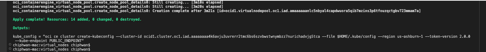

# oke-virtual-node-terraform

## Introduction

This Terraform stack facilitates the deployment of an Oracle Container Engine for Kubernetes (OKE) Virtual Nodes cluster in your tenancy. This stack will automatically provision the necessary network infrastructure components such as Virtual Cloud Network (VCN), subnets, Internet Gateway, NAT Gateway, and security rules. Additionally, you can deploy the relevant policies in the root compartment of your tenancy to enable operations of OKE Virtual Nodes and also includes the option to deploy a metrics server to the cluster.

## Pre-requisites

- [OCI CLI installed with the required credentials to deploy OKE in your tenancy](https://docs.oracle.com/en-us/iaas/Content/API/SDKDocs/cliinstall.htm)
- [kubectl installed](https://kubernetes.io/docs/tasks/tools/)
- [Terraform Installed](https://developer.hashicorp.com/terraform/tutorials/aws-get-started/install-cli)

Click 

## Installation of Terraform stack

**1. Clone or download the contents of this repo** 
     
     git clone https://github.com/chiphwang1/oke-virtualnodes.git

**2. Change to the directory that holds the Terraform stack** 

      cd ./oke-virtualnodes

**3. Populate the varaibles.tf file**

**4. Install the Terraform stack**

     terraform init
     terraform plan
     teraffrom apply
  

**5. Add Kubeconfig of Virtual Node cluster**

     
 run oci command in output of terraform apply

###  Sample Output 

###  Sample command
 oci ce cluster create-kubeconfig --cluster-id ocid1.cluster.oc1.iad.aaaaaaaas3qhb3xf7figx7fuvr2v6ubon2zwyomqhx7buwnwjccsz2w46esq --file $HOME/.kube/config --region us-ashburn-1 --token-version 2.0.0  --kube-endpoint PUBLIC_ENDPOINT    

**7. To remove Terraform stack**

     terraform destroy
     
 
##  variables.tf specification

| Variables                          | Description                                                         | Type   | Mandatory |
| ---------------------------------- | ------------------------------------------------------------------- | ------ | --------- |
| `compartment_id` | Compartment to deploy OKE Virtual Nodes cluster | string | yes  |
| `region` | region to deploy the OKE Virtual Nodes Cluster  | string | yes     |
| `node_shape` | The shape of Virtual Nodes | string | yes       |
| `node_size` | The number of Virtual Nodes in the node pool  | number | yes       |
| `create_oke_virtual_node_policy` | To create the policy for for Virtual Node operations. Set to "true" to create the policy | bool | yes       |
| `root_compartment_id` | Root compartment to deploy OKE Virtual Nodes policy | string | yes if  `create_oke_virtual_node_policy` is set to true |
| `create_metrics_server` | install metrics server. Set to "true" to create the policy | string | yes  |

## Useful commands 

**1. Check Virtual Nodes status**
     
     kubectl get nodes -o wide

## Additional Resources

- [OKE Virtual Nodes deliver a serverless Kubernetes experience](https://blogs.oracle.com/cloud-infrastructure/post/oke-virtual-nodes-deliver-serverless-experience)
- [Oracle Container Engine for Kubernetes(OKE)](https://www.oracle.com/cloud/cloud-native/container-engine-kubernetes/#:~:text=Oracle%20Cloud%20Infrastructure%20Container%20Engine,complexities%20of%20the%20Kubernetes%20infrastructure.)
